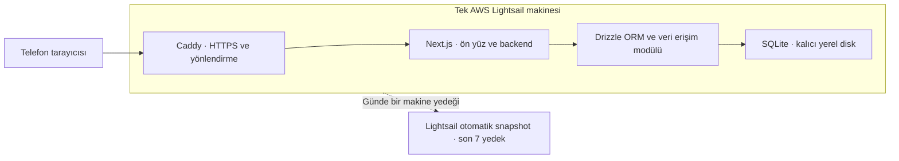

# Tech Stack: Dolmuş Takip

**Yazan:** Codex; Doğukan ile yürütülen planlama
**Tarih:** 2026-09-15
**Versiyon:** v0.11
**Durum:** MVP başlangıç teknoloji seçimleri netleşti; uygulama/sürüm ve kapasite doğrulaması bekliyor.
**İlgili PRD:** [PRD](PRD.md)
**İlgili mimari:** [Architecture](ARCHITECTURE.md)

Blueprint’in teknoloji şablonuna göre düzenlendi. Kullanıcının önerileri uygulama onayıyla aşağıdaki başlangıç seçimleri netleştirildi. Yardımcı araçlar bu yetki altında Codex tarafından seçildi; kullanıcı her kütüphaneyi isim isim seçmiş sayılmaz. Kurulum, kod ve kapasite testi yapılmadı.

## Karar verme kriterleri

| Kriter | Bu projede değerlendirme şekli |
|---|---|
| Ekip aşinalığı | Ekibin gerçek deneyimi; henüz karşılaştırmalı bilgi yok. |
| Topluluk ve doküman | Resmî kaynaklar mevcut; topluluk büyüklükleri karşılaştırılmadı. |
| Olgunluk | Seçilecek sürümün destek ve değişiklik geçmişi; sürümler açık. |
| Maliyet | Makine, yedek, lisans ve işletim emeği birlikte değerlendirilir. |
| Bağımlılıktan çıkış | Veri/kod taşıma ve motora özgü değişikliklerin maliyeti. |
| Performans | Temsili kayıt/rapor yüküyle ölçüm; henüz test yapılmadı. |
| İşe alım havuzu | Gelecekte bakım yapacak kişileri bulabilme; piyasa araştırması yapılmadı. |

1–5 puan ve toplam uydurulmadı: deneyim, piyasa ve ölçüm verileri eksik. Aşağıdaki karşılaştırmalar mevcut gereksinimler ve okunan resmî belgelerle sınırlı nitel değerlendirmelerdir.

Güncel hedef **en fazla 500 toplam kullanıcı**; eşzamanlı 500 kişi varsayılmıyor. Eski 200 kullanıcı tahmini güncel değil; 200 araç hedefi farklı ölçüdür. 100 eşzamanlı kullanıcı ayrıca test edilmesi istenen tepe senaryosudur.

## 1. Frontend

### Adaylar

| Aday | Gerekçe | Açık değerlendirme |
|---|---|---|
| Next.js + TypeScript | Telefon arayüzü ve backend tek projede tutulabilir. | Ekip aşinalığı, sürümler ve gerçek yük ölçümü. |
| Django ile sunucuda hazırlanan HTML | Backend ile birlikte tam yığın alternatif. | Arayüz etkileşimleri ve ekip tercihi ayrıca değerlendirilecek. |

**Seçim: Next.js + React + TypeScript; ön yüz ve backend tek proje.** Görsel uygulamada Tailwind CSS ve telefonun yerleşik okunaklı sistem fontu kullanılacak. PRD’nin mavi-beyaz, Türkçe, orta/yarı kalın vurguları ve büyük dokunma alanları korunur. Font indirme veya kapsamlı UI paketi zorunlu değildir. [Tailwind utility sınıfları](https://tailwindcss.com/docs/styling-with-utility-classes).

**Seçilmedi notları:** Django ilk sürüm için seçilmedi; tek TypeScript projesi yaklaşımı tercih edildi.

## 2. Backend

### Adaylar

| Aday | Gerekçe | Maliyet / bakım sınırı |
|---|---|---|
| Node.js üzerinde Next.js | Ön yüz ve sunucu işlemleri tek proje. | Kendi makinemizde çalışabilir; kaynak ve dağıtım ölçülecek. |
| Django tam yığın | Python backend ve sunucuda HTML üretimiyle alternatif. | Ekip deneyimi ve uygulama yöntemi açık. |

**Seçim: Node.js 24 LTS üzerinde Next.js.** Node ana sürümü seçildi; yama sürümü ve paket uyumluluğu uygulama başlangıcında sabitlenecek. [Node.js sürüm durumu](https://nodejs.org/en/about/previous-releases). Vercel zorunlu değildir. [Next.js kendi sunucunda çalıştırma](https://nextjs.org/docs/app/guides/self-hosting).

**Seçilmedi notları:** Django ilk sürümde seçilmedi; ön yüz/backend tek proje tutuluyor. Supabase kullanıcı tarafından reddedildi.

## 3. Veritabanı

### Adaylar

| Aday | Gerekçe / uygunluk | Sınır ve değerlendirme |
|---|---|---|
| SQLite | SQL ve ilişkisel raporlar; ayrı DB sunucu servisi yok. | Aynı anda tek writer; temsili yük testi gerekli. |
| PostgreSQL | Yoğun eşzamanlı yazma veya çoklu uygulama sunucusunda güçlü aday. | Aynı makineye kurulabilir; servis bakımı ve RAM ihtiyacı ekler. |
| MySQL | Aynı makinede kurulabilen ilişkisel alternatif. | Ayrıntılı karşılaştırması yapılmadı; ayrı makine zorunlu değil. |
| NoSQL: DynamoDB/MongoDB | Raporlama ve transaction yapabilirler. | SQL bu projedeki ilişkiler için daha doğrudan öneri; ürünlere özgü model ve maliyet ayrıca değerlendirilir. |

**Seçim: SQLite + Drizzle ORM + better-sqlite3; migration aracı Drizzle Kit.** Toplam kullanıcı sayısı tek başına yeterlilik kanıtı değildir. [SQLite kullanım alanları](https://www.sqlite.org/whentouse.html). PostgreSQL/MySQL için ayrı makine veya sorgu başına ücret zorunlu değildir. [PostgreSQL mimarisi](https://www.postgresql.org/docs/current/tutorial-arch.html), [lisansı](https://www.postgresql.org/about/licence/).

**Seçilmedi notları:** PostgreSQL, MySQL ve NoSQL ilk sürümde seçilmedi. Daha az servisle başlamak için SQLite tercih edildi; sürekli yazma darboğazı veya çoklu uygulama sunucusu ihtiyacında PostgreSQL geçiş seçeneğidir. DynamoDB’de erişim desenleri ve bazı raporlar önceden tasarlanır; faturalama seçime dahildir. Bütün NoSQL ürünleri istek başına ücretli sayılmaz. [DynamoDB modelleme](https://docs.aws.amazon.com/amazondynamodb/latest/developerguide/bp-modeling-nosql.html), [transaction desteği](https://docs.aws.amazon.com/amazondynamodb/latest/developerguide/transaction-apis.html).

### Veri erişimi / ORM — Drizzle seçildi

İş kuralları ve ekranlara doğrudan ORM tablo tanımları veya SQLite SQL’i yayılmasın; veri erişimi küçük bir modülde toplansın. Kayıt, hesap sonucu ve revizyon aynı transaction sınırında kalsın; işletme filtreleri ve PRD’deki para kuralları korunsun. Ham SQL gereken raporlar da bu modülde, parametreli sorgularla tutulabilir; taşınabilirlikleri ayrıca kontrol edilir. Tüm veritabanlarını destekleyen genel bir çatı tasarlamak amaçlanmıyor.

Bu yaklaşım SQLite’tan PostgreSQL’e geçerken değişecek kod alanını azaltabilir, fakat geçişi otomatik yapmaz. Şema, veri tipleri, tarih/para gösterimi ve sorgu farkları uyarlanır; motora özgü SQL migration’ları çoğunlukla yeniden ele alınır. Mevcut kayıtlar ayrıca taşınır; rapor toplamları, kişi–araç–işletme bağları ve revizyonlar doğrulanır. Yalnız bağlantı adresini değiştirmek yeterli değildir; migration komutu mevcut veriyi kendiliğinden yeni motora taşımaz.

Drizzle, TypeScript içinde açık SQL/şema yönetimi ve küçük veri erişim modülü yaklaşımı için seçildi; kanıtlanmış performans üstünlüğü iddia edilmiyor. Prisma ilk sürümde seçilmedi; araçların özellikleri eşdeğer sayılmıyor. Drizzle motorlara göre ayrı dialect/şema tanımları kullanır; Prisma’nın ilgili migration belgesi de motorlar arası SQL uyumsuzluğunu açıklar. [Drizzle şema tanımları](https://orm.drizzle.team/docs/sql-schema-declaration), [Prisma migration sınırları](https://www.prisma.io/docs/orm/v7/prisma-migrate/understanding-prisma-migrate/limitations-and-known-issues).

better-sqlite3 senkron ve native modüldür; uzun rapor sorgularının uygulama yanıtına etkisi ve hedef Linux/CPU/Node uyumluluğu kontrol edilecek. [Drizzle SQLite sürücüleri](https://orm.drizzle.team/docs/get-started-sqlite). ORM, SQLite’ın aynı anda tek writer sınırını kaldırmaz.

### SQLite uygulama koşulları

- Veritabanı kalıcı yerel diskte, uygulama yayınıyla silinmeyen konumda tutulacak.
- Yazma işlemleri kısa olacak; foreign key denetimleri etkinleştirilecek ve doğru işletme/araç bağları sunucuda doğrulanacak.
- Para kuruş hassasiyetinde tam sayı tutulacak. İşletme/araç/tarih/kişi sorgularına uygun indeksler, sunucuda SQL toplama ve sayfalı detay kullanılacak; her istekte tüm geçmiş uygulamaya yüklenmeyecek. İndeks/şema ve süre kabul eşikleri sonraki mimari adımda belirlenecek.
- Çalışma kaydı, hesap sonucu ve revizyon birlikte atomik yazılacak. Başarısız işlem yarım kayıt bırakmayacak.
- WAL ve foreign key denetimleri etkinleştirilecek; bekleme süresi yönetilecek; kilit hataları yönetilecek. WAL aynı anda birden fazla writer sağlamaz. Tekrarlanan istekler kayıt çoğaltmayacak.
- Makine snapshot’ından geri gelen SQLite verisinin bütünlüğü ve uygulama kayıtları doğrulanacak. Canlı veritabanının yalnız ana dosyasını gelişigüzel kopyalamak güvenilir yedek yöntemi sayılmayacak. Tutarlı SQLite kopyası gerekirse desteklenen backup yöntemi kullanılabilir; bu bir S3 veya saatlik yedek planı seçimi değildir. [SQLite backup yöntemleri](https://www.sqlite.org/backup.html).

Para hesapları, sabit şoför kaydı, ortak şifre sınırları, sahip/platform destek yetkileri ve iz geçmişi için PRD esas alınır. Caddy/Next.js/SQLite seçimi uygulamanın yetkilendirmesini veya güvenliğini kendiliğinden sağlamaz.

## 4. Auth / Identity

**Seçim: SQLite’ta iptal edilebilir sunucu oturumları.** Tarayıcıda rastgele token taşıyan HttpOnly/Secure/SameSite cookie, sunucuda token özeti tutulacak. Ayrı bireysel ekip hesapları kullanılacak. Ürün akışı PRD’de kesin: plaka + ayrı sahip/ortak şoför şifresi; ortak şoför girişinde araç için tanımlı listeden kişi seçimi. Bu liste doğrulanmış bireysel giriş hesabı değildir. [Sunucuda veritabanı oturumları](https://nextjs.org/docs/app/guides/authentication#database-sessions).

Aynı aracın sahip ve ortak şoför şifreleri farklı olmalıdır. Rol plaka ve şifreden çıkarıldığı için oluşturma ve sıfırlamada diğer rolün şifresiyle eşitlik reddedilir; kullanıcıya yeni rol seçme adımı eklenmez.

Sahip ve ayrı platform back office yetkileri sunucuda işletme/araç bağlamına göre denetlenir. Destek işlemlerinde gerçek ekip kullanıcısı, kim adına yapıldığı ve önce/sonra revizyonu korunur. Şifreler güvenli hash olarak saklanır; düz metin görüntüleme yerine sıfırlama vardır. Para ve yetki kurallarının ayrıntısı PRD’de kalır.

CSRF/origin koruması, giriş hız sınırı, parola sıfırlama ve araç pasifliğinde oturum iptali uygulanacak. Hazır kriptografik primitive/kütüphaneler kullanılacak; özel şifreleme algoritması yazılmayacak. Mimari taslakta node-argon2/Argon2id, başlangıç parametreleri ve oturum süreleri tanımlandı; kesin paket sürümü ve kapasite ölçümü uygulama başlangıcında doğrulanacak.

**Seçilmedi notları:** Harici auth sağlayıcısı, OTP, halka açık kayıt veya e-posta kurtarma akışı eklenmedi.

## 5. Infrastructure / Deployment

**Seçim: tek AWS Lightsail.** Seçilen başlangıç paketi Frankfurt/Linux, 2 vCPU, 2 GB RAM, 60 GB SSD, IPv4 ve 3 TB transfer; **12 USD/ay**. Bu kapasite ölçülmüş garanti değildir. Amaç küçük başlangıç maliyeti ve tek makinede işletimdir; Ubuntu LTS seçildi; kesin imaj ve yama sürümü kurulum öncesi uyumlulukla sabitlenecek.

### Web sunucusu — Caddy seçildi

**Caddy:** HTTPS sertifikasını uygun alan adı/DNS ve ağ koşullarında otomatik edinip yeniler; gelen istekleri Next.js’e yönlendiren ayarı sadedir. Bu nedenle başlangıçta seçildi. Next.js için Caddy zorunlu değildir: Nginx de reverse proxy olarak kullanılabilir; Apache de değerlendirilebilir. Nginx/Apache ilk sürüm için seçilmedi; yerleşik sertifika yönetimi ve sade ayar nedeniyle Caddy tercih edildi. [Caddy otomatik HTTPS](https://caddyserver.com/docs/automatic-https), [Nginx rehberi](https://nginx.org/en/docs/beginners_guide.html), [Apache belgeleri](https://httpd.apache.org/docs/2.4/).

### Seçilen başlangıç planı

Diyagram seçilen başlangıç planını gösterir; uygulanmış bir kurulum değildir. Snapshot, makinenin içindeki ikinci bir dosya kopyası değil, Lightsail’ın makine dışında tuttuğu yedektir.

ORM/veri erişim katmanı aynı uygulamanın kod modülüdür; ayrı makine veya servis kurulmasını gerektirmez.

### Maliyet ve işletim sınırları

**12 USD/ay yalnız başlangıç Lightsail paketidir.** Yukarıdaki Linux/IPv4 paketinin kaynakları buna dahildir. Snapshot depolama ayrıca **0,05 USD/GB-ay**; vergiler, alan adı ve kota üstü trafik ayrıca olabilir. Yedek maliyeti gerçek faturalanan depolama/değişiklik hacmine bağlıdır; 60 GB × 7 tam kopya varsayımıyla fatura hesaplanmaz. [Lightsail fiyatlandırması](https://aws.amazon.com/lightsail/pricing/).

SQLite’ın bu makinede çalışması sorgu sayısına göre ayrı AWS veritabanı faturası çıkarmaz; sorgular makinenin CPU, RAM ve disk kaynaklarını tüketir. Kurulum anında bölge/paket fiyatı tekrar kontrol edilir; indirim veya kredi varsayılmamıştır.

Tek makine durursa uygulama da durur. Güncelleme, yeniden başlatma, disk doluluğu, logların büyümesi, yedek kontrolü ve kurtarma ekibimizin sorumluluğudur. RAM/CPU, disk, yanıt süreleri, eşzamanlı yazma ve kilit hataları ölçülecek; kapasite veya veritabanı değişikliği bu bulgulara göre değerlendirilecek.

### 100 eşzamanlı kullanıcı: doğrulanacak test planı

Kullanıcının değerlendirilmesini istediği **100 eşzamanlı kullanıcı**, ölçülmüş trafik değildir; henüz performans testi yapılmadı. Açık 100 oturum, aynı anda 100 HTTP isteği veya 100 veritabanı yazması demek değildir. Bir kullanıcı birden fazla istek de üretebilir. ORM, SQLite’ın tek writer sınırını çözmez.

| Aday | Tek makine ve veritabanı | Paket / ay | Değerlendirme |
|---|---|---:|---|
| A — seçilen başlangıç | 2 vCPU, 2 GB RAM, 60 GB SSD; SQLite | 12 USD | Önce temsili 100 kullanıcı senaryosuyla test et. |
| B — bellek alternatifi | 2 vCPU, 4 GB RAM, 80 GB SSD; SQLite | 24 USD | Daha fazla bellek; SQLite yazma sınırı değişmez. |
| C — veritabanı alternatifi | 2 vCPU, 4 GB RAM, 80 GB SSD; aynı makinede PostgreSQL | 24 USD | Ayrı makine veya yönetilen DB hizmeti faturası zorunlu değil; servis bakımı ve RAM ihtiyacı eklenir. |

A başlangıç için seçildi; B ve C koşullu yükseltme seçenekleridir. Tablo ölçülmüş kapasite karşılaştırması değildir. Fiyatlar 15 Eylül 2026 tarihli Linux/IPv4 paketleridir; snapshot, vergi, alan adı ve kota üstü trafik dahil değildir. [AWS Lightsail fiyatları](https://aws.amazon.com/lightsail/pricing/).

Testte üç ayrı durum değerlendirilecek:

- 100 kullanıcının kısa aralıkta giriş yapması.
- 100 aktif kullanıcının gerçekçi bekleme süreleriyle kayıt, rapor ve teslim doğrulama işlemlerini karışık kullanması.
- 100 kayıt isteğinin kısa sürede gelmesi; yazma kuyruğu, bekleme ve hata davranışı.

Yalnız kısa tepe testiyle yetinilmeyecek; temsili geçmiş veri hacmiyle sürdürülen yük de gözlenecek. Yanıt süreleri, hata oranı, RAM/CPU, disk ve kilit beklemeleri ölçülecek. Başarılı denilen kayıtların kaybolmaması, tekrar denemede çift kayıt oluşmaması, rapor toplamları ve teslim doğrulamalarının tutarlılığı kontrol edilecek. Test süresi, istek hızı ve kabul eşikleri uygulama testi hazırlanırken belirlenecek.

**Başlangıç kararı:** Maliyeti düşük tutmak için A ile başlayıp ölçmek; bellek darboğazı görülürse B’yi değerlendirmek. Kısa işlemler ve sorgu iyileştirmelerine rağmen sürekli yazma beklemeleri sürerse veya çoklu uygulama sunucusu gerekirse PostgreSQL’i değerlendirmek. C’deki tek makine, kendi başına çoklu uygulama sunucusu kurulumu değildir. CPU zorlanıyorsa yalnız RAM artırmak çözüm sayılmaz; rapor/sorgu ve iş yükü ayrıca incelenir. 4 GB yükseltmesi veya PostgreSQL geçişi seçilmedi.

### Doğrudan Lightsail üzerinde test

Uygulama hazır olduğunda, kullanıcılara açılmadan önce seçilen Lightsail üzerinde native kurulum ve **üretim derlemesiyle** yukarıdaki giriş, kayıt ve rapor senaryoları test edilecek. Temsili veri kullanılacak; yük üreticisi ayrı ortamda çalışacak. Gerçek sunucunun RAM/CPU, disk, yanıt süreleri, hataları ve veri tutarlılığı ölçülecek. Uygulama henüz yok; test yapılmadı.

Makinenin toplam kaynak bütçesi uygulama, web sunucusu, varsa DB servisi ve işletim sistemi tarafından paylaşılır. RAM/swap ayarları ve Lightsail burst CPU davranışı ölçümle birlikte kaydedilecek. [Lightsail burst kapasitesi](https://docs.aws.amazon.com/lightsail/latest/userguide/amazon-lightsail-viewing-instance-burst-capacity.html).

**Karar notu:** Docker/Compose şimdilik kullanılmayacak; kullanıcı karmaşıklığı azaltmak istedi. Yerel container testi, paketleme ve üretim dağıtımı önerisi aktif plandan çıkarıldı.

## 6. Storage / Object Store

**Seçim:** Günde bir Lightsail native makine snapshot’ı ve son yedi otomatik yedek. **SQLite seçildi.** Veri doğrudan makinenin kalıcı yerel diskinde, yayın sırasında silinmeyecek bir dizinde tutulacak; seçilen makine snapshot’ı bu dizini kapsamalıdır. S3 kurulmayacak; yeni object store seçilmedi.

**Günde bir Lightsail otomatik makine snapshot’ı alınacak; son yedi otomatik snapshot tutulacak. S3 ve saatlik yedek kurulmayacak.** Son başarılı yedekten sonra girilen kayıtların geri yüklemede kaybolabileceği kullanıcıya açıklandı ve bu tercih kabul edildi. Yedek başarısız kalırsa kayıp aralığı daha uzun olabilir; bu nedenle son başarılı yedeğin kontrolü gereklidir. [Lightsail snapshot davranışı](https://docs.aws.amazon.com/lightsail/latest/userguide/amazon-lightsail-faq-snapshots.html).

Yedi yedek tutmak, uygulamadaki kayıtları yedi günde silmek değildir. PRD’deki en az beş yıllık kayıt saklama gereksinimi devam eder. Snapshot takvimi ile uygulama verisinin saklama süresi ayrı konulardır.

Kaynak makine silinince otomatik snapshot’lar da silinir. Uzun süre korunacak kopya, makine silinmeden önce **manuel snapshot olarak saklanmalıdır**. [Otomatik snapshot’ı koruma](https://docs.aws.amazon.com/lightsail/latest/userguide/amazon-lightsail-keeping-automatic-snapshots.html).

Geri yükleme denemesinde makinenin açılması yanında son kayıtlar, kişi/araç ilişkileri, revizyonlar ve rapor toplamları kontrol edilecek. Yedek alınmış olması tek başına başarı kabul edilmeyecek; üretimden bağımsız restore testi yapılacak. Saat seçimi ve SQLite tutarlılığının doğrulanacağı yöntem uygulama aşamasında belirlenir; günlük native snapshot tercihi korunur.

## 7. Queue / Async Messaging

**Seçim: ilk sürümde harici kuyruk veya Redis eklememek.** Mevcut PRD harici kuyruk gerektirmiyor. Bu kalıcı yasak veya uygulanmış davranış güvencesi değildir; SQLite yazma beklemesi ayrı mesajlaşma servisi ihtiyacı diye yorumlanmaz.

## 8. Observability (Logs / Metrics / Traces)

**Seçim: journald + yapılandırılmış uygulama logları; Lightsail CPU/ağ metrikleri ve yerel RAM/disk/health kontrolleri.** RAM/disk ölçümü AWS tarafından otomatik sağlanıyor varsayılmaz. Yanıt süreleri, hata ve kilit beklemeleri, log büyümesi, son başarılı yedek ve restore tutarlılığı izlenecek. Operasyon uyarı kanalı ve eşikler uygulama planında belirlenecek; ek ücretli gözlem servisi seçilmedi. Henüz ölçüm yapılmadı.

## 9. CI/CD

**Seçim: GitHub Actions ile hedef Linux/CPU/Node uyumlu üretim derlemesi ve test; SSH üzerinden sürümlü çıktı ile manuel tetiklenen kontrollü yayın.** Production’a her push’ta otomatik yayın yoktur. Özel repoda Actions dakika ve artifact depolama kotaları sınırlıdır; ücretsiz/sınırsız sayılmaz. Ek ücretli kullanım seçmeden bütçe ve limitler kontrol edilir. [GitHub Actions](https://docs.github.com/en/actions/get-started/understand-github-actions), [Actions faturalama](https://docs.github.com/en/billing/concepts/product-billing/github-actions).

**Native süreç yönetimi: systemd.** Caddy ve uygulama servisleri açılışta başlayacak, çökmede yeniden başlatılacak. [Caddy systemd işletimi](https://caddyserver.com/docs/running). Docker/Compose kullanılmayacak.

Next.js derlemesi 2 GB makineyi zorlayabilir; üretim makinesinde build varsayılmaz. CI çıktısı ve better-sqlite3 native modülü hedef Linux/CPU/Node sürümüne uygun hazırlanacak. Uygulama kodu sürümlü dizinlerde, kalıcı veritabanı ayrı dizinde tutulacak. Migration ile kod geri dönüşü ayrıdır; eski koda dönmek şemayı veya veriyi otomatik geri almaz. Güvenli dönüş sırası ve migration kontrolleri mimari/uygulama planında netleşecek.

Hedef CPU mimarisi, kesin semver ve lockfile sürümleri uygulama başlangıcında sabitlenecek. Henüz kurulum, workflow veya yayın yapılmadı.

### Uygulama test araçları

Geliştirme öncesi [QA planında](QA-PLAN.md) **Vitest** birim ve gerçek geçici SQLite entegrasyon kontrolleri, **Playwright** gerçek uygulama üzerindeki tarayıcı akışları için seçildi. Bunlar geliştirme/test araçlarıdır; yeni canlı sunucu hizmeti veya Next.js yerine başka frontend derleyicisi seçilmez. Para işlemi/ilişki/çakışma kanıtı yalnız taklit DB ile üretilmez. [Vitest rehberi](https://vitest.dev/guide/), [Playwright kurulumu](https://playwright.dev/docs/intro).

Kesin uyumlu test aracı sürümleri diğer bağımlılıklarla T1.1/T6.1'de lockfile'a sabitlenir. QA planı koddan önce yazılır; testler ilgili hikâye geliştirilirken eklenir. Henüz test kodu veya sonuç yoktur.

## 10. Email / Notification

**Seçim: ilk sürümde müşteri e-posta/SMS servisi eklememek.** Mevcut MVP’de bu bildirim ihtiyacı yok. İşletim uyarıları için kanal seçimi ayrıca açık; yeni ürün bildirimi veya kurtarma özelliği eklenmiyor.

## Özet tablo

| Katman | Seçim / durum | Versiyon |
|---|---|---|
| Frontend | Next.js + React + TypeScript | Kesin sürümler uygulama başlangıcında |
| Backend | Node.js / Next.js | Node 24 LTS; yama ve Next sürümü sabitlenecek |
| DB | SQLite | Sabitlenecek |
| Auth | SQLite sunucu oturumları; güvenli cookie, token özeti; Argon2id | Başlangıç parametreleri mimaride; kesin sürüm/test bekliyor |
| Infra | Frankfurt Lightsail 2 vCPU / 2 GB / 60 GB / IPv4 / 3 TB, 12 USD/ay | Paket; yazılım sürümü değil |
| Storage | Kalıcı yerel DB; günlük son 7 native snapshot | Uygulanmaz |
| Queue | İlk sürümde harici queue/Redis yok | Uygulanmaz |
| Observability | journald, uygulama logları, Lightsail CPU/ağ, yerel kontroller | Eşik/uyarı kanalı açık |
| CI/CD | GitHub Actions; SSH ile manuel tetiklenen sürümlü yayın | Workflow/araç sürümleri sabitlenecek |
| Email/Notification | İlk sürümde müşteri e-posta/SMS servisi yok | Uygulanmaz |
| Web sunucusu | Caddy HTTPS/reverse proxy | Sabitlenecek |
| İşletim sistemi | Ubuntu LTS | İmaj/yama uyumlulukla sabitlenecek |
| Veri erişimi | Drizzle ORM + better-sqlite3 + Drizzle Kit | Kesin sürümler ve lockfile sabitlenecek |
| Süreç yönetimi / test | systemd; doğrudan Lightsail’da üretim derlemesi testi | Test sonucu henüz yok |
| CSS/UI ve font | Tailwind CSS; yerleşik sistem fontu | Tailwind sürümü sabitlenecek |

## Onaylar

| Karar veren | Rol | Onay kapsamı | Tarih |
|---|---|---|---|
| Doğukan | Proje sahibi / karar veren | Tek Lightsail barındırma | 2026-09-15 |
| Doğukan | Proje sahibi / karar veren | Günlük native snapshot, son 7 yedek; son başarılı yedek sonrası veri kaybı sınırı kabul edildi | 2026-09-15 |
| Doğukan | Proje sahibi / karar veren | “Önerilerini uygula” talebi: bu belgedeki MVP başlangıç planını netleştirme; yardımcı teknik seçimler Codex tarafından bu kapsamda yapıldı | 2026-09-15 |

Bu onay kütüphanelerin kullanıcı tarafından tek tek adlandırıldığı anlamına gelmez. Sunucu satın alma, kurulum veya kod çalıştırma yapılmadı. 4 GB yükseltmesi ve kapasite garantisi onay kapsamı değildir.

## Versiyon geçmişi

| Versiyon | Tarih | Değişiklik | Yazan |
|---|---|---|---|
| v0.1 | 2026-09-15 | İlk teknoloji belgesi | Codex |
| v0.2 | 2026-09-15 | ORM/veri erişimi ve geçiş sınırları | Codex |
| v0.3 | 2026-09-15 | 100 kullanıcı yük senaryoları ve kapasite adayları | Codex |
| v0.4 | 2026-09-15 | Docker yerel ön test önerisi | Codex |
| v0.5 | 2026-09-15 | Blueprint şablonuna hizalama; durum ve eksik kararların ayrımı | Codex |
| v0.6 | 2026-09-15 | Docker/Compose önerisi kaldırıldı; native Lightsail testi | Codex |
| v0.7 | 2026-09-15 | Onay kapsamında başlangıç teknolojileri ve yardımcı araçlar seçildi | Codex |
| v0.8 | 2026-09-15 | Mimari taslağına bağlantı; auth ayrıntılarının mimariyle eşitlenmesi | Codex |
| v0.9 | 2026-09-15 | Hazırlanan ekran tasarımı ve Epics planına bağlantı; sonraki aşama Stories | Codex |
| v0.10 | 2026-09-15 | 35 kullanıcı hikâyesine bağlantı; sonraki öneri Milestones ve teknik iş paketleri | Codex |
| v0.11 | 2026-09-15 | Geliştirme öncesi tüm planlara bağlantı; Vitest/Playwright test araçları ve QA zamanı | Codex |

**Sonraki adım:** [Mimari](ARCHITECTURE.md), [ekran tasarımı](DESIGN.md) ve [Epics planı](EPICS.md) hazır. [Stories](STORIES.md) içinde 35 hikâye yazıldı; açık kararlar ilgili işlerde ele alınacak. [Milestones](MILESTONES.md), [Tasks](TASKS.md), [QA planı](QA-PLAN.md), [Release](RELEASE.md) ve [Ops](OPS.md) geliştirme öncesi planlama zincirini tamamlar. Sonraki uygulama işi M1'dir. Kesin sürüm uyumluluğu ve kapasite testleri uygulama aşamasında doğrulanacak. Kod veya bulut kurulumu yapılmadı.
